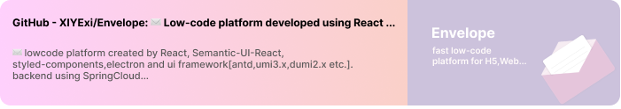
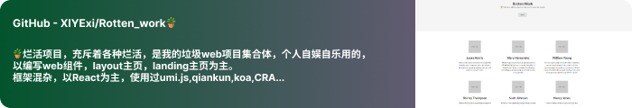

<div align="center">
   <h1>Hi there, I'm <a href="https://hemant.codes">Xiye</a> 
 </h1>

    
</div>

<p align='center'>
    <a href="/"></a>&nbsp;&nbsp;
    <a href="/"></a>&nbsp;&nbsp;
    <a href="/"></a>&nbsp;&nbsp;
    <a href="/"></a>&nbsp;&nbsp;
    <a href="/"></a>&nbsp;&nbsp;
 </p>


<div align="center">
    <h3>
    
        🙎 沙拉夕子xiyeye | 💻 Full Stack Developer | 🛸 China  
    </h3>
</div>

<br />
 
<h5 align="center">
   <i>⚡️带着发霉的梦，寻觅月亮⚡️</i>
</h5>
<br />


<p align="center">
  <h3> A Full-stack developers driven by interest</h3>
</p>

 - 🥀 Java & TypeScript believers
 
 - <i>with Javascript, React, SpringBoot, SpringCloud, Flask and so on...</i>
   
 - 🔭 Why not develop TypeScript that does not require type validation, <del>why don't we call it JavaScript</del>😼

 - 🛸 My favorite character is やなみあんな（Yanami Anna）.
 
 - 💬 I do fullstack and a bit of everything :heart:
 
 - All About living life at its best.

<p align="center">
  <h4> Full Stack | Agile Development </h4>
</p>

<br/>

<details>
<summary>📊 this week i spent my time on:</summary>

```txt
No activity tracked !
```
</details>

<br />

<details>
<summary>i need coffeeeeeeee</summary>

if you like what i do, maybe consider buying me a coffee/tea (plz send to b309🥺👉👈) 

<a href="#" target="_blank"></a>

</details>

<br />


### - **languages and tools...**

<a href=''>
   <p align='left>
     
  </p>
</a>


<br/>
   
<a href=''>
   <p align='left'>
     
   </p>
</a>

<br />

### - Blogs 🌱

> No, I don't have blogs!😭😭😭


<br />

### - What i do 🐖 Appearance trajectory 


<br />

<a href="https://github.com/XIYExi/Envelope">
<p  align='center'></p>
</a>

<a  href="https://github.com/XIYExi/Rotten_work">
<p align='center'></p>
</a>


<p align="center">
   
</p>


   
<br />

<h2 align="center">🤝 Support</h2>

<p align="center">🎀 Contributions (<a href="https://guides.github.com/introduction/flow" title="GitHub flow">GitHub Flow</a>), 🔥 issues, and 🥮 feature requests are most welcome!</p>

<p align="center">💙 If you like my projects, Give them ⭐ and Share it with friends!</p>
</p>
<p align="center">Made with ❤️ in Wuxi, China</p>

<h1 align='center'>⚡️<i>Stay awesome!</i>⚡️</h1>

<p align="center">

</p>
